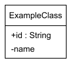
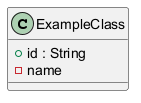

# Minimal Theme for PlantUML

A theme for PlantUML that gives it a minimalistic mostly black-and-white appearance similar to some of the default styled diagrams made using [Astah](https://astah.net/).

# Preview





# Scope

The theme is designed mostly for class diagrams, but also works for other UML diagrams supported by PlantUML.
Support for more types of diagrams is the main aim of future development.

# Usage

To use the theme in your PlantUML diagrams, include the `minimal-theme.puml` file at the beginning of your PlantUML source code like this:

## Using the Permalink

```plantuml
!include https://raw.githubusercontent.com/fredoslav2004/MinimalThemePUML/e6795a75a396d14eee91444c83e736a4037bdcf9/minimal-theme.puml
```

## Using the Local File

```plantuml
!include .\minimal-theme.puml

```

# Affiliation

This project is not affiliated with or endorsed by the Astah software or its developers in any way.
